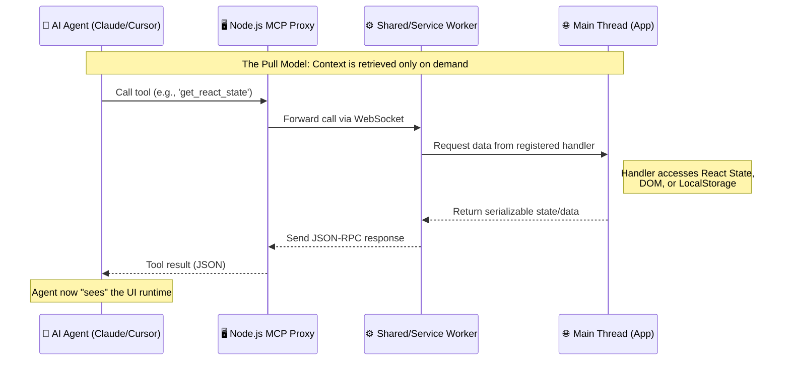
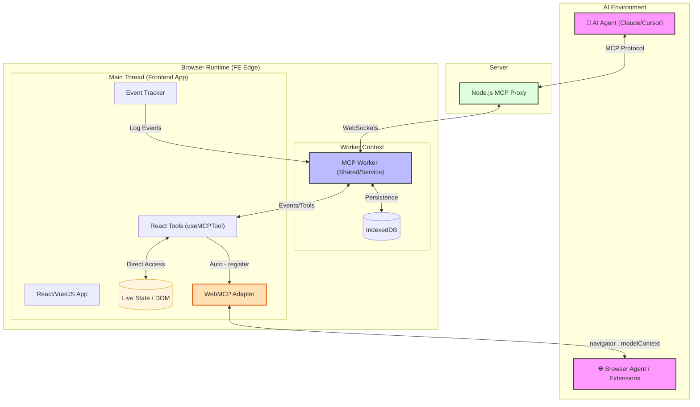

# MCP-FE — Frontend Edge for AI Agents

[](https://www.npmjs.com/package/@mcp-fe/mcp-worker)
[](./LICENSE)
[]()
[]()

**Give AI agents eyes and hands inside your live React app.**

MCP-FE turns your browser into an active MCP node — letting agents like Claude or Cursor query live state, read user context, and trigger actions directly inside your frontend. No browser extension required.

```tsx
// One hook. Claude can now see and control this component.
useMCPTool({
  name: 'get_cart_items',
  description: 'Returns current items in the shopping cart',
  inputSchema: { type: 'object', properties: {} },
  handler: async () => ({
    content: [{ type: 'text', text: JSON.stringify(cartItems) }],
  }),
});
// ✅ Available to remote agents via MCP proxy
// ✅ Available to browser's agent via navigator.modelContext (if supported)
```

> 🌐 **[Try the Live Demo](https://demo.mcp-fe.ai)** — no setup required &nbsp;·&nbsp; 🎬 **[Watch demo](https://www.youtube.com/watch?v=FwEWE4QSdNk)** &nbsp;·&nbsp; 🌍 **[mcp-fe.ai](https://mcp-fe.ai)** &nbsp;·&nbsp; 📦 `pnpm add @mcp-fe/mcp-worker`

---

## Why MCP-FE?

AI agents are often **runtime-blind**: they can read your code, but they can't see the current DOM, the state of a Redux/Zustand store, or the exact interaction sequence that led to an error.

MCP-FE exposes the **browser runtime** as a first-class MCP Server so that context is retrievable **on demand** via tool calls.

### What this enables

- **In-app AI copilot** — give users an AI assistant that truly understands your application. Because tools return structured component data rather than pixels or DOM nodes, the agent works reliably even as your UI evolves. "Book the cheapest Tuesday flight" or "fill the form with my usual details" — the agent reads live state and triggers actions directly, no browser extension required.

- **Support with full context** — when a user opens a support chat, the agent immediately queries `get_form_state` or `get_validation_errors` instead of asking for screenshots. It sees exactly what the user sees — active errors, current field values, where they are in a flow — and resolves issues in seconds rather than back-and-forth exchanges.

- **Guided complex workflows** — in tax forms, insurance claims, or ERP systems, users often get lost in deep menus and multi-step flows. The agent knows exactly which step they're on, what's already filled, and what's missing — and can navigate or configure the UI on their behalf instead of pointing them to documentation.

- **Ready for the browser AI era** — as AI browser extensions and built-in browser agents become mainstream, apps with MCP-FE are already compatible. Via the WebMCP adapter, the browser's native agent gets structured semantic tools through `navigator.modelContext` instead of scraping the DOM. One `registerTool()` call covers both today's remote agents and tomorrow's browser-native ones.

---

## Table of Contents

- [Quick Start](#quick-start-local-live-demo)
- [How It Works](#how-it-works)
- [Key Concepts](#key-concepts)
- [WebMCP — Native Browser Integration](#webmcp--native-browser-integration)
- [Security by Design](#security-by-design)
- [Architecture](#architecture)
- [Packages](#packages)
- [Using MCP-FE in Your App](#using-mcp-fe-in-your-app)
- [Security Roadmap](#security-roadmap--known-limitations)
- [Project Status](#project-status)
- [Contributing](#contributing)
- [License](#license)

---

## Quick Start (Local Live Demo)

This monorepo includes a small demo frontend app and the MCP proxy. Run the commands below to start a **local live demo** on your machine.

1) Install dependencies

```bash
pnpm install
```

2) Start the demo app + MCP Proxy

```bash
pnpm start
```

3) Open the demo frontend

Navigate to `http://localhost:4200` (or the port shown in your terminal). The browser worker will automatically register and connect.

4) Connect an AI agent

Point your MCP-compatible agent to:

- **MCP endpoint (HTTP):** `http://localhost:3001/mcp`

> Note: the example app connects the worker to the proxy via WebSocket (e.g., `ws://localhost:3001`).

---

## How It Works

*Runtime flow — how a tool call travels from agent to browser and back.*

Traditional MCP integrations are backend-centric. Frontends usually push events continuously, whether anyone needs them or not.

MCP-FE inverts the flow:

- **Pull, not push:** the frontend does **not** stream context by default.
- **Worker-based edge:** a browser `SharedWorker` (preferred) or `ServiceWorker` stores event history (IndexedDB) and coordinates tool calls.
- **Proxy for remote agents:** a Node.js proxy maintains a WebSocket connection to the worker and exposes MCP tools to agents.
- **Dynamic tools:** register tools from application code; handlers run in the main thread with controlled access to state/DOM/imports.


```mermaid
sequenceDiagram
  participant A as 🤖 AI Agent (Claude/Cursor)
  participant P as 🖥️ Node.js MCP Proxy
  participant W as ⚙️ Shared/Service Worker
  participant M as 🌐 Main Thread (App)
  Note over A, M: The Pull Model: Context is retrieved only on demand
  A ->> P: Call tool (e.g., 'get_react_state')
  P ->> W: Forward call via WebSocket
  W ->> M: Request data from registered handler
  Note right of M: Handler accesses React State, <br/>DOM, or LocalStorage
  M -->> W: Return serializable state/data
  W -->> P: Send JSON-RPC response
  P -->> A: Tool result (JSON)
  Note over A: Agent now "sees" the UI runtime
```

---

## Key Concepts

### MCP Workers: SharedWorker vs ServiceWorker

- **SharedWorker (preferred):**
  - One shared instance available to all same-origin windows/iframes.
  - Good for multi-tab apps and when you want a single MCP edge connection per browser.

- **ServiceWorker (fallback):**
  - Runs in background, lifecycle managed by the browser.
  - Useful when SharedWorker is not supported.

`WorkerClient` prefers SharedWorker and automatically falls back to ServiceWorker. It also supports passing an explicit `ServiceWorkerRegistration` to use a previously registered service worker.

### Worker as an MCP Edge Server

The Shared/Service Worker acts as a lightweight **edge node** that enables you to:

- **Collect** UI-level event history (navigation, interactions, errors)
- **Store** events in IndexedDB for later retrieval
- **Expose** data and actions via MCP tools
- **Maintain** a persistent WebSocket connection to the proxy
- **Register** custom tools dynamically with handlers running in the main thread (full browser API access)

### Server-Driven Pull Model (Tool Calls)

The MCP worker **never sends context proactively to the backend**. Context is shared **only** when an AI agent explicitly requests it by calling a tool.

---

## WebMCP — Native Browser Integration

MCP-FE includes built-in support for the [**WebMCP specification**](https://webmachinelearning.github.io/webmcp/) (`navigator.modelContext`), an emerging W3C standard that allows web pages to register MCP tools directly with the browser. This means your tools are discoverable not only by remote AI agents (via the proxy), but also by **browser-native agents**, **extensions**, and **assistive technologies**.

### How it fits together

```
Your App ──→ workerClient.registerTool('my-tool', ...)
                │
                ├── ① Worker transport ──→ Proxy ──→ Remote AI agents (Claude, Cursor, ...)
                │
                └── ② WebMCP adapter ──→ navigator.modelContext.registerTool()
                                              └──→ Browser's built-in agent / extensions
```

**One `registerTool()` call → two delivery channels.** Your tool handlers are written once and automatically served to both remote agents (via WebSocket + MCP proxy) and the browser's native agent system (via `navigator.modelContext`).

### Enabled by default

WebMCP is **auto-detected** — if the browser supports `navigator.modelContext`, tools are registered there automatically. No configuration needed:

```ts
// This single call registers the tool in BOTH systems:
await workerClient.registerTool(
  'get_cart_items',
  'Returns the current shopping cart contents',
  { type: 'object', properties: {} },
  async () => ({
    content: [{ type: 'text', text: JSON.stringify(getCart()) }],
  }),
);
// ✅ Available to remote agents via MCP proxy
// ✅ Available to browser's agent via navigator.modelContext (if supported)
```

To explicitly disable WebMCP:

```ts
await workerClient.init({
  backendWsUrl: 'ws://localhost:3001',
  enableWebMcp: false,  // opt-out
});
```

### Delivery channels

| Channel            | Agent type                                           | Transport                             | Requires proxy? |
|--------------------|------------------------------------------------------|---------------------------------------|-----------------|
| **Worker + Proxy** | Remote AI agents (Claude, Cursor, etc.)              | WebSocket → HTTP/SSE                  | Yes             |
| **WebMCP**         | Browser's built-in agent, extensions, assistive tech | `navigator.modelContext` (in-process) | No              |

With WebMCP support, your frontend tools work even **without** a running proxy — the browser agent can invoke them directly. And when the proxy *is* running, remote agents get access too. Both channels coexist seamlessly.

> 📖 For implementation details, see [`libs/mcp-worker/docs/native-webmcp.md`](./libs/mcp-worker/docs/native-webmcp.md)

---

<a id="security-by-design"></a>
## 🛡️ Security by Design

Unlike traditional analytics or logging tools that stream data to third-party servers, **MCP-FE is passive and restrictive**:

- **Explicit Exposure Only**: The AI agent has **zero "magic" access** to your app. It can only see data or trigger actions that you explicitly expose via `registerTool` or `useMCPTool`.
- **Zero-Stream Policy**: No data is ever pushed automatically. Context transfer only happens when an AI agent triggers a specific tool call.
- **Local Execution**: Tool handlers run in your application's context, allowing you to implement custom authorization, filtering, or scrubbing before returning data to the agent.
- **Privacy First**: Sensitive fields (PII, passwords, tokens) never leave the client unless the developer intentionally includes them in a tool's return payload.

---

<a id="architecture"></a>
## 🏗️ Architecture

*Component overview — the three layers that make up MCP-FE.*

The MCP-FE architecture is built on three core layers designed to keep the main application thread responsive while providing a persistent link to AI agents.

### 1. The Proxy Server (Node.js)

The Proxy acts as the gateway. It speaks the standard **MCP Protocol** towards the AI agent (via HTTP/SSE) and maintains a persistent **WebSocket** connection to the browser.

- **Role**: Bridges the gap between the internet and the user's local browser session.
- **Security**: Handles Bearer token authentication to ensure only authorized agents can talk to the worker.

### 2. The MCP Worker (SharedWorker / ServiceWorker)

This is the "Brain" on the Frontend Edge. It runs in its own thread, meaning it doesn't slow down your UI.

- **Event Logging**: Automatically captures interactions and errors into **IndexedDB**.
- **Routing**: When a tool call comes from the Agent, the Worker routes it to the correct tab or the Main Thread.
- **Resilience**: Implements a **Ping-Pong mechanism** to keep the WebSocket alive even when the user isn't actively interacting with the page.

### 3. The Main Thread (Your App)

This is where your React/Vue/JS code lives.

- **Dynamic Tools**: Using hooks like `useMCPTool`, your components register handlers that have direct access to the live **DOM, State, and LocalStorage**.
- **Zero-Push**: It only executes logic and sends data when the Worker explicitly asks for it (the Pull Model).


```mermaid
graph TD
  subgraph "AI Environment"
    Agent["🤖 AI Agent (Claude/Cursor)"]
    BrowserAgent["🌐 Browser Agent / Extensions"]
  end

  subgraph "Server"
    Proxy["Node.js MCP Proxy"]
  end

  subgraph "Browser Runtime (FE Edge)"
    subgraph "Main Thread (Frontend App)"
      UI["React/Vue/JS App"]
      Hooks["React Tools (useMCPTool)"]
      State[("Live State / DOM")]
      Tracker["Event Tracker"]
      WebMCP["WebMCP Adapter"]
    end

    subgraph "Worker Context"
      Worker["MCP Worker (Shared/Service)"]
      DB[(IndexedDB)]
    end
  end

  Agent <-->|MCP Protocol| Proxy
  Proxy <-->|WebSockets| Worker
  Worker <-->|Events/Tools| Hooks
  Tracker -->|Log Events| Worker
  Worker <-->|Persistence| DB
  Hooks <-->|Direct Access| State
  Hooks -->|Auto - register| WebMCP
  WebMCP <-->|navigator . modelContext| BrowserAgent
  style Agent fill: #f9f, stroke: #333, stroke-width: 2px
  style BrowserAgent fill: #f9f, stroke: #333, stroke-width: 2px
  style Worker fill: #bbf, stroke: #333, stroke-width: 2px
  style Proxy fill: #dfd, stroke: #333, stroke-width: 2px
  style WebMCP fill: #ffe0b2, stroke: #e65100, stroke-width: 2px
  style State fill: #fff4dd, stroke: #d4a017
```

---

## Packages

MCP-FE is delivered as a set of packages in this monorepo and can be consumed directly from your applications.
For install instructions, APIs, and framework-specific examples, use the package READMEs:

| Package                       | What it's for                                                                           | Docs                                   |
|-------------------------------|-----------------------------------------------------------------------------------------|----------------------------------------|
| `@mcp-fe/mcp-worker`          | **Core**: worker client + worker scripts + transport + dynamic tool registration        | `./libs/mcp-worker/README.md`          |
| `@mcp-fe/event-tracker`       | **Core (optional)**: framework-agnostic event tracking (navigation/interactions/errors) | `./libs/event-tracker/README.md`       |
| `@mcp-fe/react-event-tracker` | **React (optional)**: drop-in hooks for automatic navigation/click/input tracking       | `./libs/react-event-tracker/README.md` |
| `@mcp-fe/react-tools`         | **React (optional)**: hooks for registering tools with component lifecycle management   | `./libs/react-tools/README.md`         |
| `mcp-server` (Docker image)   | **Proxy**: Node.js MCP server that bridges remote agents ↔ browser worker               | `./apps/mcp-server/README.md`          |

---

## Using MCP-FE in Your App

You can adopt MCP-FE incrementally. The smallest useful setup is:

1) **Run the proxy** (`mcp-server`) somewhere reachable by your users' browsers.
2) **Initialize the worker client** in your app and point it at the proxy.
3) Optionally add **event tracking** and/or **custom tools**.

Minimal frontend setup:

```bash
pnpm add @mcp-fe/mcp-worker
```

```ts
import { workerClient } from '@mcp-fe/mcp-worker';

await workerClient.init({
  backendWsUrl: 'ws://YOUR_PROXY_HOST:3001',
  // Optional: custom paths for worker scripts (useful for cache-busting)
  sharedWorkerUrl: '/mcp-shared-worker.js',
  serviceWorkerUrl: '/mcp-service-worker.js',
});
```

### Typical Integration Paths

- **Minimal (custom tools only):** `@mcp-fe/mcp-worker` + your own `registerTool(...)` handlers.
- **Observability (events + queries):** add `@mcp-fe/event-tracker` or `@mcp-fe/react-event-tracker`.
- **React-first:** `@mcp-fe/mcp-worker` + `@mcp-fe/react-tools` + `@mcp-fe/react-event-tracker`.

### Minimal Example (Worker + Tool)

```ts
import { workerClient } from '@mcp-fe/mcp-worker';

await workerClient.init({
  backendWsUrl: 'ws://localhost:3001',
});

await workerClient.registerTool(
  'get_user_data',
  'Get current user information',
  { type: 'object', properties: {} },
  async () => ({
    content: [{ type: 'text', text: JSON.stringify(getCurrentUser()) }],
  })
);
```

### Structured Output (`outputSchema`)

Tools can optionally declare an `outputSchema` — a JSON Schema describing the shape of the returned data. When provided, the agent receives strongly-typed, structured output instead of raw text, which makes it easier to consume tool results programmatically.

```ts
await workerClient.registerTool(
  'get_cart_summary',
  'Get current cart contents with totals',
  { type: 'object', properties: {} },
  async () => ({
    content: [{ type: 'text', text: JSON.stringify(getCartSummary()) }],
  }),
  {
    outputSchema: {
      type: 'object',
      properties: {
        items: { type: 'array' },
        total: { type: 'number' },
        currency: { type: 'string' },
      },
      required: ['items', 'total'],
    },
  }
);
```

With `useMCPTool` (React):

```tsx
useMCPTool({
  name: 'get_cart_summary',
  description: 'Get current cart contents with totals',
  inputSchema: { type: 'object', properties: {} },
  outputSchema: {
    type: 'object',
    properties: {
      items: { type: 'array' },
      total: { type: 'number' },
      currency: { type: 'string' },
    },
    required: ['items', 'total'],
  },
  handler: async () => ({
    content: [{ type: 'text', text: JSON.stringify(getCartSummary()) }],
  }),
});
```

---

<a id="security-roadmap--known-limitations"></a>
## 🚧 Security Roadmap & Known Limitations

We are actively working on hardening the proxy and worker. Contributions and PRs are highly welcome!

**Resolved ✅**

- ~~**Strict JWT Verification:** The Node proxy used a "mock" decoded JWT without verifying the signature.~~ → Implemented `jwtVerify()` with HS256 (local mode) and JWKS-based RS256 validation (Keycloak mode).

- ~~**Secure Token Transport:** WebSockets initiated using `?token=...` in the URL query string.~~ → Migrated to an initial payload handshake: client sends `{ type: "AUTH", token }` as the first WebSocket message.

**Open**

- [ ] **Privacy-First Event Tracking:** Default `trackInput()` hook captures raw input values. Roadmap: track length/hashes only, ignore `type="password"`, introduce opt-in allowlist.

- [ ] **WebSocket Origin Validation:** Stricter origin allowlist enforcement beyond the current `CORS_ORIGIN` configuration.

- [ ] **Data Retention Limits (client-side):** `SESSION_TTL_MINUTES` is configurable on the server, but the local IndexedDB has no automatic TTL yet.

---

<a id="project-status"></a>
## ⚠️ Project Status: Experimental (PoC)

This project is currently a **Proof of Concept**. While the architecture is stable and demonstrates the power of MCP-FE, it is not yet intended for high-stakes production environments.

**Current focus:**

- Finalizing the SharedWorker/ServiceWorker fallback logic.
- Refining the React hook lifecycle (auto-deregistration of tools).
- Hardening the Proxy-to-Worker authentication flow.

---

## Contributing

Contributions, issues, and architectural discussions are welcome!

- **Bug reports & feature requests:** open an issue on [GitHub](https://github.com/mcp-fe/mcp-fe/issues)
- **Pull requests:** feel free to submit fixes or improvements — please open an issue first for larger changes so we can align on the approach
- **Discussions:** architecture questions and ideas belong in [GitHub Discussions](https://github.com/mcp-fe/mcp-fe/discussions)

---

## License

Licensed under the Apache License, Version 2.0. See [LICENSE](./LICENSE) for details.

---

## 👨‍💻 Author

**Michal Kopecký** — Frontend engineer & creator of MCP-FE

I built MCP-FE to solve the "runtime-blindness" of current AI agents. By treating the browser as an active edge-node, we can provide agents with deep, real-time context without sacrificing user privacy or network performance.

[GitHub](https://github.com/kopecmi8) · [LinkedIn](https://linkedin.com/in/michal-kopecký) · [mcp-fe.ai](https://mcp-fe.ai)
