# MCP-FE (Model Context Protocol - Frontend Edge)

**MCP-FE** turns the browser runtime into an active, queryable node in the MCP ecosystem.
Instead of continuously pushing analytics-style data, your frontend exposes **on-demand MCP tools** so an AI agent can ask questions about **what just happened** and **what the UI state is right now**.

It bridges the gap between AI agents (e.g., Claude or Cursor) and the real-time state of your frontend application using:
- a browser worker (SharedWorker / ServiceWorker) that stores events and routes tool calls,
- a Node.js proxy that exposes an MCP endpoint to remote agents, and
- **native [WebMCP](https://webmachinelearning.github.io/webmcp/) support** — when the browser implements `navigator.modelContext`, tools are automatically registered with the browser's built-in agent system too.

## Why MCP-FE?
AI agents are often **runtime-blind**: they can read your code, but they can’t see the current DOM, the state of a Redux/Zustand store, or the exact interaction sequence that led to an error.

MCP-FE exposes the **browser runtime** as a first-class MCP Server so that context is retrievable **on demand** via tool calls.

---

## ⚠️ Project Status: Experimental (PoC)

This project is currently a **Proof of Concept**. While the architecture is stable and demonstrates the power of MCP-FE, it is not yet intended for high-stakes production environments.

**Current focus:**
* Finalizing the SharedWorker/ServiceWorker fallback logic.
* Refining the React hook lifecycle (auto-deregistration of tools).
* Hardening the Proxy-to-Worker authentication flow.

*See the security roadmap section below for more details.*

---

## Table of Contents
- [Quick Start (Local Live Demo)](#quick-start-local-live-demo)
- [How It Works](#how-it-works)
- [Key Concepts](#key-concepts)
- [WebMCP — Native Browser Integration](#webmcp--native-browser-integration)
- [Packages](#packages)
- [Using MCP-FE in Your App](#using-mcp-fe-in-your-app)
- [Architecture](#architecture)
- [Security roadmap](#security-roadmap--known-limitations)
- [License](#license)

---

## Quick Start (Local Live Demo)

This monorepo includes a small demo frontend app and the MCP proxy. Run the commands below to start a **local live demo** on your machine.

1) Install dependencies

```bash
pnpm install
```

2) Start the demo app + MCP Proxy

```bash
pnpm start
```

3) Open the demo frontend

Navigate to `http://localhost:4200` (or the port shown in your terminal). The browser worker will automatically register and connect.

4) Connect an AI agent

Point your MCP-compatible agent to:
- **MCP endpoint (HTTP):** `http://localhost:3001/mcp`

> Note: the example app connects the worker to the proxy via WebSocket (e.g., `ws://localhost:3001`).

---

## How It Works
Traditional MCP integrations are backend-centric. Frontends usually push events continuously, whether anyone needs them or not.

MCP-FE inverts the flow:
- **Pull, not push:** the frontend does **not** stream context by default.
- **Worker-based edge:** a browser `SharedWorker` (preferred) or `ServiceWorker` stores event history (IndexedDB) and coordinates tool calls.
- **Proxy for remote agents:** a Node.js proxy maintains a WebSocket connection to the worker and exposes MCP tools to agents.
- **Dynamic tools:** register tools from application code; handlers run in the main thread with controlled access to state/DOM/imports.


---

## Key Concepts

### MCP Workers: SharedWorker vs ServiceWorker

- **SharedWorker (preferred):**
  - One shared instance is available to all same-origin windows/iframes.
  - Good for multi-tab apps and when you want a single MCP edge connection per browser.

- **ServiceWorker (fallback):**
  - Runs in background, lifecycle managed by the browser.
  - Useful when SharedWorker is not supported.

`WorkerClient` in this repo prefers SharedWorker and automatically falls back to ServiceWorker. It also supports passing an explicit `ServiceWorkerRegistration` to use a previously registered service worker.

### Worker as an MCP Edge Server

The Shared/Service Worker acts as a lightweight **edge node** that enables you to:

- **Collect** UI-level event history (navigation, interactions, errors)
- **Store** events in IndexedDB for later retrieval
- **Expose** data and actions via MCP tools
- **Maintain** a persistent WebSocket connection to the proxy
- **Register** custom tools dynamically with handlers running in the main thread (full browser API access)

### Server-Driven Pull Model (Tool Calls)

The MCP worker **never sends context proactively to the backend**. Context is shared **only** when an AI agent explicitly requests it by calling a tool.

---

## WebMCP — Native Browser Integration

MCP-FE includes built-in support for the [**WebMCP specification**](https://webmachinelearning.github.io/webmcp/) (`navigator.modelContext`), an emerging W3C standard that allows web pages to register MCP tools directly with the browser. This means your tools are discoverable not only by remote AI agents (via the proxy), but also by **browser-native agents**, **extensions**, and **assistive technologies**.

### How it fits together

```
Your App ──→ workerClient.registerTool('my-tool', ...)
                │
                ├── ① Worker transport ──→ Proxy ──→ Remote AI agents (Claude, Cursor, ...)
                │
                └── ② WebMCP adapter ──→ navigator.modelContext.registerTool()
                                              └──→ Browser's built-in agent / extensions
```

**One `registerTool()` call → two delivery channels.** Your tool handlers are written once and automatically served to both remote agents (via WebSocket + MCP proxy) and the browser's native agent system (via `navigator.modelContext`).

### Enabled by default

WebMCP is **auto-detected** — if the browser supports `navigator.modelContext`, tools are registered there automatically. No configuration needed:

```ts
// This single call registers the tool in BOTH systems:
await workerClient.registerTool(
  'get_cart_items',
  'Returns the current shopping cart contents',
  { type: 'object', properties: {} },
  async () => ({
    content: [{ type: 'text', text: JSON.stringify(getCart()) }],
  }),
);
// ✅ Available to remote agents via MCP proxy
// ✅ Available to browser's agent via navigator.modelContext (if supported)
```

To explicitly disable WebMCP:

```ts
await workerClient.init({
  backendWsUrl: 'ws://localhost:3001',
  enableWebMcp: false,  // opt-out
});
```

### Why this matters

| Channel | Agent type | Transport | Requires proxy? |
|---------|-----------|-----------|----------------|
| **Worker + Proxy** | Remote AI agents (Claude, Cursor, etc.) | WebSocket → HTTP/SSE | Yes |
| **WebMCP** | Browser's built-in agent, extensions, assistive tech | `navigator.modelContext` (in-process) | No |

With WebMCP support, your frontend tools work even **without** a running proxy — the browser agent can invoke them directly. And when the proxy *is* running, remote agents get access too. Both channels coexist seamlessly.

> 📖 For implementation details, see [`libs/mcp-worker/docs/native-webmcp.md`](./libs/mcp-worker/docs/native-webmcp.md)

---

## 🛡️ Security by Design

Unlike traditional analytics or logging tools that stream data to third-party servers, **MCP-FE is passive and restrictive**:

* **Explicit Exposure Only**: The AI agent has **zero "magic" access** to your app. It can only see data or trigger actions that you explicitly expose via `registerTool` or `useMCPTool`.
* **Zero-Stream Policy**: No data is ever pushed automatically. Context transfer only happens when an AI agent triggers a specific tool call.
* **Local Execution**: Tool handlers run in your application's context, allowing you to implement custom authorization, filtering, or scrubbing before returning data to the agent.
* **Privacy First**: Sensitive fields (PII, passwords, tokens) never leave the client unless the developer intentionally includes them in a tool's return payload.

---

## 🏗️ Architecture

The MCP-FE architecture is built on three core layers designed to keep the main application thread responsive while providing a persistent link to AI agents.

### 1. The Proxy Server (Node.js)
The Proxy acts as the gateway. It speaks the standard **MCP Protocol** towards the AI agent (via HTTP/SSE) and maintains a persistent **WebSocket** connection to the browser.
* **Role**: It bridges the gap between the internet and the user's local browser session.
* **Security**: Handles Bearer token authentication to ensure only authorized agents can talk to the worker.

### 2. The MCP Worker (SharedWorker / ServiceWorker)
This is the "Brain" on the Frontend Edge. It runs in its own thread, meaning it doesn't slow down your UI.
* **Event Logging**: Automatically captures interactions and errors into **IndexedDB**.
* **Routing**: When a tool call comes from the Agent, the Worker routes it to the correct tab or the Main Thread.
* **Resilience**: Implements a **Ping-Pong mechanism** to keep the WebSocket alive even when the user isn't actively interacting with the page.

### 3. The Main Thread (Your App)
This is where your React/Vue/JS code lives.
* **Dynamic Tools**: Using hooks like `useMCPTool`, your components register handlers that have direct access to the live **DOM, State, and LocalStorage**.
* **Zero-Push**: It only executes logic and sends data when the Worker explicitly asks for it (the Pull Model).

```mermaid
graph TD
    subgraph "AI Environment"
        Agent["🤖 AI Agent (Claude/Cursor)"]
        BrowserAgent["🌐 Browser Agent / Extensions"]
    end

    subgraph "Server"
        Proxy["Node.js MCP Proxy"]
    end

    subgraph "Browser Runtime (FE Edge)"
        subgraph "Main Thread (Frontend App)"
            UI["React/Vue/JS App"]
            Hooks["React Tools (useMCPTool)"]
            State[("Live State / DOM")]
            Tracker["Event Tracker"]
            WebMCP["WebMCP Adapter"]
        end

        subgraph "Worker Context"
            Worker["MCP Worker (Shared/Service)"]
            DB[(IndexedDB)]
        end
    end

    %% Connections
    Agent <-->|MCP Protocol| Proxy
    Proxy <-->|WebSockets| Worker
    Worker <-->|Events/Tools| Hooks
    Tracker -->|Log Events| Worker
    Worker <-->|Persistence| DB
    Hooks <-->|Direct Access| State
    Hooks -->|Auto-register| WebMCP
    WebMCP <-->|navigator.modelContext| BrowserAgent

    %% Styles
    style Agent fill:#f9f,stroke:#333,stroke-width:2px
    style BrowserAgent fill:#f9f,stroke:#333,stroke-width:2px
    style Worker fill:#bbf,stroke:#333,stroke-width:2px
    style Proxy fill:#dfd,stroke:#333,stroke-width:2px
    style WebMCP fill:#ffe0b2,stroke:#e65100,stroke-width:2px
    style State fill:#fff4dd,stroke:#d4a017
```



---

## Packages

MCP-FE is delivered as a set of packages in this monorepo and can be consumed directly from your applications.
For install instructions, APIs, and framework-specific examples, use the package READMEs:

| Package                       | What it’s for | Docs |
|-------------------------------| --- | --- |
| `@mcp-fe/mcp-worker`          | **Core**: worker client + worker scripts + transport + dynamic tool registration | `./libs/mcp-worker/README.md` |
| `@mcp-fe/event-tracker`       | **Core (optional)**: framework-agnostic event tracking (navigation/interactions/errors) | `./libs/event-tracker/README.md` |
| `@mcp-fe/react-event-tracker` | **React (optional)**: drop-in hooks for automatic navigation/click/input tracking | `./libs/react-event-tracker/README.md` |
| `@mcp-fe/react-tools`         | **React (optional)**: hooks for registering tools with component lifecycle management | `./libs/react-tools/README.md` |
| `mcp-server` (Docker image)   | **Proxy**: Node.js MCP server that bridges remote agents ↔ browser worker | `./apps/mcp-server/README.md` |

### Using MCP-FE in Your App

You can adopt MCP-FE incrementally. The smallest useful setup is:

1) **Run the proxy** (`mcp-server`) somewhere reachable by your users’ browsers.
2) **Initialize the worker client** in your app and point it at the proxy.
3) Optionally add **event tracking** and/or **custom tools**.

Minimal frontend setup:

```bash
pnpm add @mcp-fe/mcp-worker
```

```ts
import { workerClient } from '@mcp-fe/mcp-worker';

await workerClient.init({
  backendWsUrl: 'ws://YOUR_PROXY_HOST:3001',
});
```

### Typical Integration Paths

- **Minimal (custom tools only):** `@mcp-fe/mcp-worker` + your own `registerTool(...)` handlers.
- **Observability (events + queries):** add `@mcp-fe/event-tracker` or `@mcp-fe/react-event-tracker`.
- **React-first:** `@mcp-fe/mcp-worker` + `@mcp-fe/react-tools` + `@mcp-fe/react-event-tracker`.

### Minimal Example (Worker + Tool)

```ts
import { workerClient } from '@mcp-fe/mcp-worker';

await workerClient.init({
  backendWsUrl: 'ws://localhost:3001',
});

await workerClient.registerTool(
  'get_user_data',
  'Get current user information',
  { type: 'object', properties: {} },
  async () => ({
    content: [{ type: 'text', text: JSON.stringify(getCurrentUser()) }],
  })
);
```

---

## Summary

MCP-FE introduces a **worker-based MCP edge server** in the browser that enables:

- server-driven context access (pull model),
- minimal frontend-to-server traffic,
- clean separation between UI, transport, and agent logic,
- **dual delivery** — tools are served to remote agents (via proxy) and browser-native agents (via [WebMCP](https://webmachinelearning.github.io/webmcp/)) simultaneously.

It's a **new frontend application of the Model Context Protocol**, not a new protocol.

---

## 🚧 Security Roadmap & Known Limitations

We are actively working on hardening the proxy and worker. Contributions and PRs for these are highly welcome!

[ ] Strict JWT Verification: Currently, the Node proxy uses a "mock" decoded JWT (trusting the sub claim) to establish session IDs for the sake of easy local testing. Roadmap: Implement cryptographically secure jwtVerify() with proper issuer/audience validation.

[ ] Secure Token Transport: WebSockets currently initiate using ?token=... in the URL query string, which can leak into server logs. Roadmap: Migrate WebSocket auth to headers (Sec-WebSocket-Protocol), initial payload messages, or secure cookies.

[ ] Privacy-First Event Tracking: The default React trackInput() hook currently captures raw input values to IndexedDB to feed the agent context. Roadmap: Change the default behavior to only track value length/hashes, automatically ignore type="password", and introduce an explicit opt-in allowlist for sensitive data tracking.

[ ] WebSocket Origin Validation: The WS server needs stricter host and origin allowlist enforcement to prevent cross-origin hijacking.

[ ] Data Retention Limits: Add automatic TTLs and mechanisms to clear the local user-activity-db IndexedDB instance to minimize the impact of potential XSS attacks.

Security Contributions: If you are a security-minded engineer, we would love your help! Feel free to pick up any of these items from our issue tracker or open a discussion on how to best secure the AI-to-UI bridge.

---

## License

Licensed under the Apache License, Version 2.0 (the "License");
you may not use this file except in compliance with the License.
You may obtain a copy of the License at

    http://www.apache.org/licenses/LICENSE-2.0

Unless required by applicable law or agreed to in writing, software
distributed under the License is distributed on an "AS IS" BASIS,
WITHOUT WARRANTIES OR CONDITIONS OF ANY KIND, either express or implied.
See the License for the specific language governing permissions and
limitations under the License.

---


## 👨‍💻 Author

**Michal Kopecký** - *Frontend engineer*

I created **MCP-FE** to solve the "runtime-blindness" of current AI agents. By treating the browser as an active edge-node, we can provide agents with deep, real-time context without sacrificing user privacy or network performance.
* [GitHub](https://github.com/kopecmi8) | [LinkedIn](https://linkedin.com/in/michal-kopecký)

*Feel free to reach out for architectural discussions or collaboration!*
